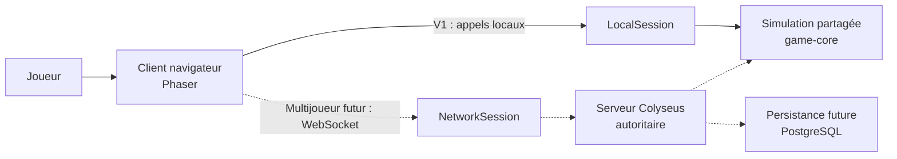
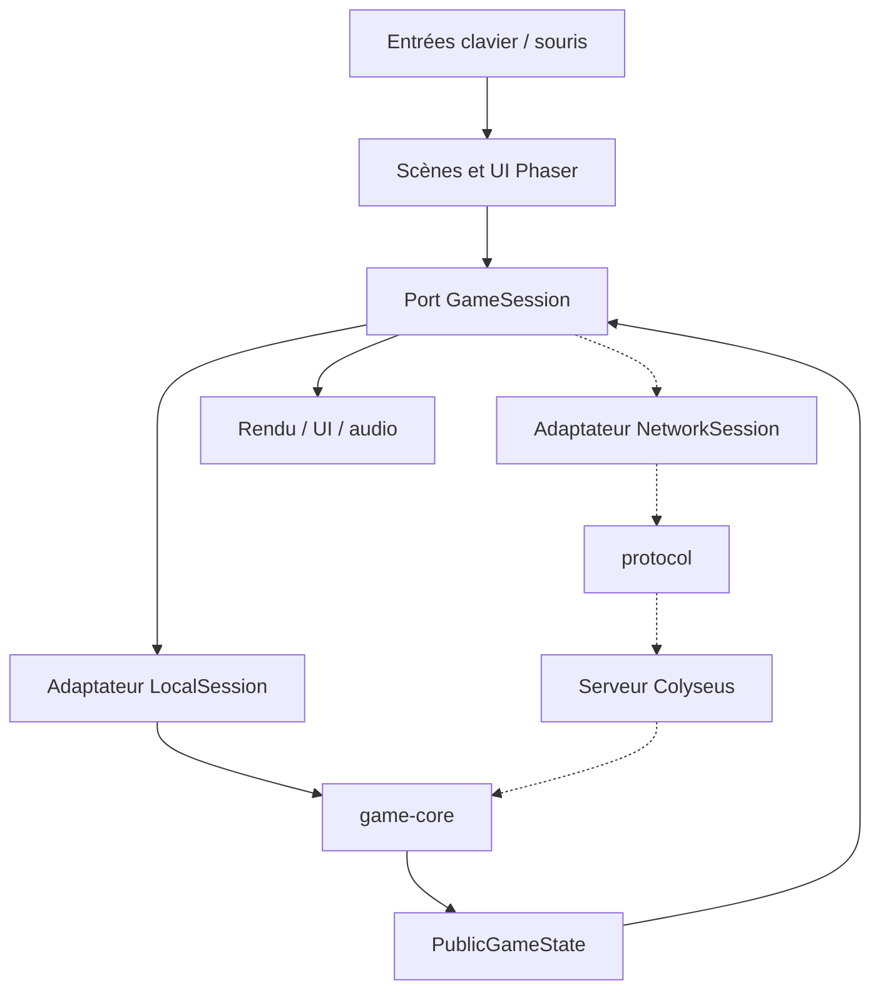
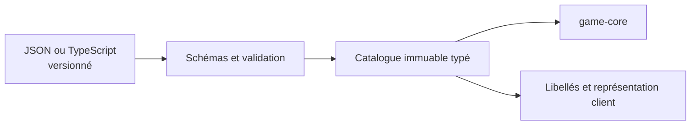

# Vue d'ensemble de l'architecture

Statut : **architecture locale M1 implémentée, architecture réseau planifiée**
Date : 21 juillet 2026

## 1. Objectif

L'architecture permet de valider rapidement le jeu en solo local tout en conservant
la même simulation et la même interface client lors du passage à un serveur
multijoueur autoritaire.

Le cadrage normatif complet se trouve dans
[`../requirements/initial-technical-baseline.md`](../requirements/initial-technical-baseline.md).
Les règles fonctionnelles se trouvent dans
[`../product/product-pillars.md`](../product/product-pillars.md).

## 2. État actuel

M1 livre le client Phaser dans `apps/client`, le port `GameSession` dans
`packages/protocol`, le catalogue validé dans `packages/content`, la simulation à pas
fixe dans `packages/game-core` et l'adaptateur `LocalSession` côté client. Les tests
Vitest et Playwright ainsi que le pipeline GitHub Actions couvrent ce chemin local.

Le serveur Colyseus, `NetworkSession`, la persistance et le déploiement public restent
planifiés. Dans les diagrammes suivants, les liens en pointillés représentent ces
capacités futures.

## 3. Contexte du système



Les liens en pointillés représentent des capacités futures qui ne doivent pas être
implémentées avant leur incrément.

## 4. Principe central : ports et adaptateurs

Le client de rendu dépend d'un port `GameSession`, jamais directement de la simulation
ou de Colyseus.



Cette frontière apporte trois garanties :

1. Phaser reste remplaçable et ne devient pas propriétaire des règles du jeu ;
2. la simulation locale est testable sans navigateur ;
3. le passage au réseau remplace un adaptateur au lieu de réécrire le client.

## 5. Composants et responsabilités

| Composant | Responsabilité | Dépendances autorisées | Interdictions principales |
|---|---|---|---|
| `apps/client` | Entrées, scènes Phaser, rendu, UI, audio, debug de développement | `protocol`, port de session, assets | Règles de gameplay, décisions autoritaires |
| `apps/server` | Rooms, connexions, validation réseau, orchestration autoritaire | `game-core`, `protocol`, contenu | Dépendance à Phaser ou au DOM |
| `packages/game-core` | État et règles déterministes, systèmes, temps fixe, aléatoire | Bibliothèques pures strictement nécessaires, contenu validé | Phaser, navigateur, WebSocket, stockage externe |
| `packages/protocol` | Commandes, événements, schémas et types publics | Validation/sérialisation minimale | Règles de gameplay et rendu |
| `packages/content` | Définitions et équilibrage versionnés | Schémas de contenu | Accès réseau, rendu ou état mutable de partie |
| `assets` | Sources et résultats graphiques/sonores avec provenance | Scripts d'assets | Logique de gameplay |
| `tests` | Scénarios transverses, navigateur, performance et réseau | Interfaces publiques | Contournement des frontières de production |

Les composants client, `protocol`, `content`, `game-core` et `tests` existent depuis
M1. `apps/server` et les scripts d'assets seront créés avec leur premier incrément.

## 6. Direction des dépendances

La direction autorisée est orientée vers les règles et les contrats stables :

```text
client ────────> protocol
  │
  └── LocalSession ──> game-core ──> contenu validé

server ────────> protocol
  └────────────> game-core ────────> contenu validé
```

`game-core` ne dépend jamais du client, du serveur, de Phaser ou de Colyseus.
`protocol` ne dépend jamais de `game-core` : il décrit les échanges, pas les règles
qui les interprètent.

## 7. Modèle d'exécution de la simulation

### Temps

- La simulation avance par ticks de durée fixe.
- Le rendu peut interpoler entre deux états sans modifier l'état officiel.
- Une accumulation de temps convertit le temps réel en zéro, un ou plusieurs ticks.
- Un plafond empêche une accumulation incontrôlée après un long blocage du navigateur.
- Les constantes temporelles utilisent une unité explicite.

### Aléatoire

- Chaque partie possède une graine explicite.
- Tout aléatoire de gameplay passe par une source injectée et contrôlée.
- L'ordre d'itération susceptible d'influencer le résultat reste stable.
- Les tests enregistrent la graine utilisée pour reproduire un échec.

### État

- L'état de référence est constitué de données sérialisables.
- Les identifiants d'entités sont stables pendant la partie.
- Les commandes décrivent des intentions ; les systèmes valident et appliquent leurs
  effets.
- `PublicGameState` ne révèle que les données nécessaires au client.
- Les événements utiles au rendu sont distincts de l'état persistant d'un tick à
  l'autre.

Le déterminisme est recherché dans les limites raisonnables de JavaScript. Une
reproductibilité vérifiée par tests prévaut sur une promesse théorique de déterminisme
entre toutes les machines possibles.

## 8. Flux local

1. Le client construit une `LocalSession` avec un contenu validé et une graine.
2. `LocalSession.start()` initialise la simulation et la boucle à pas fixe.
3. Les entrées sont normalisées en `PlayerInput` puis envoyées avec `sendInput()`.
4. La simulation valide les intentions et avance.
5. La session publie un `PublicGameState` immuable pour le client.
6. Phaser rend cet état sans recalculer les règles.
7. `stop()` libère timers, abonnements et ressources.

## 9. Flux réseau futur

1. Le client remplace `LocalSession` par `NetworkSession`.
2. Les intentions séquencées sont validées puis transmises au serveur.
3. La room Colyseus possède l'instance autoritaire de `game-core`.
4. Le serveur publie des snapshots ou deltas d'état public.
5. Le client interpole les états distants et pourra prédire son déplacement.
6. Toute divergence est corrigée par l'état officiel du serveur.

Les dégâts, collisions, récompenses, morts et positions officielles restent calculés
par le serveur. La reconnexion et la prédiction ne seront ajoutées qu'après la première
room fonctionnelle.

## 10. Contenu et équilibrage

Le contenu est traité comme une entrée de la simulation :



Principes :

- identifiants stables et uniques ;
- relations entre contenus validées ;
- unités visibles dans les noms ou types ;
- aucune valeur d'équilibrage cachée dans une scène ;
- erreurs de validation lisibles au démarrage et en CI ;
- données de test minimales séparées du catalogue de production.

## 11. Rendu et assets

Phaser traduit l'état public en objets visuels. Les objets Phaser peuvent être mis en
pool et interpolés, mais ne définissent jamais la vérité du jeu.

Les premiers assets sont temporaires et standardisés. Tout asset conserve dans ses
métadonnées sa source, son auteur, sa licence et les transformations effectuées. Les
scripts vérifient progressivement dimensions, transparence, alignement et complétude.

## 12. Observabilité et débogage

Le mode développement expose une API `window.__VILLAGE_SURVIVOR_DEBUG__` qui permet à
Playwright et aux développeurs d'inspecter l'état et de provoquer des situations
contrôlées. Elle est éliminée ou rendue inaccessible dans le build de production.

Les métriques de développement incluent au minimum, quand les systèmes existent :

- FPS de rendu ;
- durée du tick de simulation ;
- nombre total et nombre actif d'entités ;
- graine et numéro du tick courant ;
- erreurs de contenu et commandes rejetées.

## 13. Stratégie de tests par couche

| Niveau | Objet | Outil principal |
|---|---|---|
| Unitaire | Règles, calculs, validation, systèmes isolés | Vitest |
| Simulation | Parties sans rendu, déterminisme, victoire/défaite | Vitest |
| Contrat | Compatibilité session, commandes, événements, schémas | Vitest |
| Navigateur | Démarrage, entrées, UI, console, assets, debug API | Playwright |
| Réseau futur | Rooms, synchronisation, validation, déconnexion | Vitest et clients de test Colyseus |
| Performance | Scénarios reproductibles de simulation et rendu | Scripts dédiés et Playwright |

## 14. Déploiement cible

- Le client Vite produit des fichiers statiques déployés sur Cloudflare Workers Static
  Assets.
- Le futur serveur est empaqueté dans une image Docker sans état local indispensable.
- Les environnements local, preview/staging et production possèdent leurs propres
  configurations.
- GitHub Actions interdit tout déploiement si formatage, lint, types, tests ou build
  échouent.
- Les secrets ne sont présents ni dans le dépôt, ni dans les bundles du client.

Voir [`../deployment.md`](../deployment.md) pour le processus prévu et son état réel.

## 15. Décisions architecturales associées

- [ADR-0001 — Monorepo pnpm](../decisions/0001-pnpm-monorepo.md)
- [ADR-0002 — Simulation indépendante à pas fixe](../decisions/0002-headless-fixed-step-simulation.md)
- [ADR-0003 — Frontière GameSession](../decisions/0003-game-session-boundary.md)
- [ADR-0004 — Serveur multijoueur autoritaire](../decisions/0004-authoritative-multiplayer-server.md)
- [ADR-0005 — Contenu piloté par les données](../decisions/0005-data-driven-content.md)
- [ADR-0006 — Persistance différée](../decisions/0006-defer-persistence.md)

## 16. Garde-fous pour le premier MVP

Le premier MVP peut réduire le nombre de cartes, ennemis, disciplines, bâtiments et
ressources. Il ne peut pas contourner les invariants suivants :

1. les règles restent hors de Phaser ;
2. le client passe par `GameSession` ;
3. le temps de simulation est fixe et la graine explicite ;
4. le contenu est centralisé et validé ;
5. les tests peuvent piloter le jeu sans interpréter uniquement des pixels ;
6. le code local ne suppose pas que le client sera autoritaire en multijoueur ;
7. les commandes racine et la CI restent la porte d'entrée commune.

Tout assouplissement de ces invariants exige un ADR explicite avant l'implémentation.
